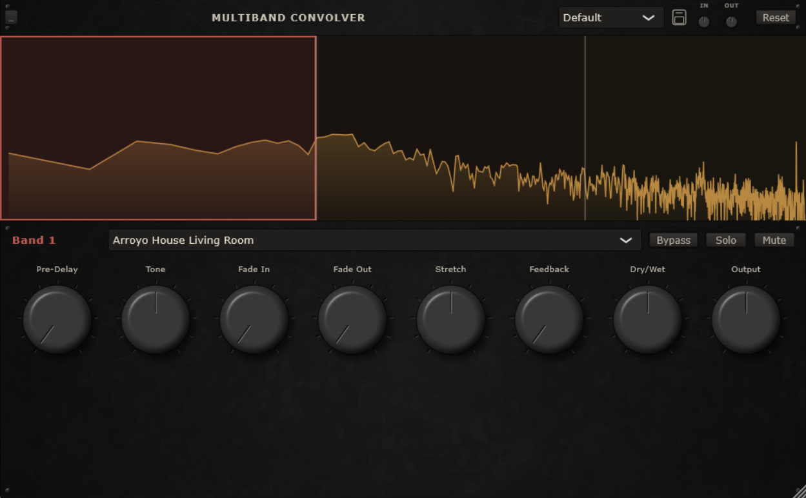

# Multiband Convolver

A multiband convolution reverb VST3/Standalone plugin built with JUCE. Split incoming audio
across up to 8 frequency bands (click to add a band, drag its edges to resize it), then run
each band through its own independent convolution reverb loaded from a curated library of real
room/plate/spring impulse responses -- so, for example, the low end can sit in a tight room
while the highs bloom in a cathedral, all in one instance.



## Features

- **Draggable band editor** with a live spectrum analyzer background -- click empty space to add
  a band, drag an edge to resize it. Bands share crossover edges, so there are no gaps or
  overlaps between them.
- **Independent convolution per band** against a selectable impulse response.
- **Per-band macro controls**: Dry/Wet, Tone (tilt EQ), Fade In, Fade Out (decay/length control),
  Stretch, Feedback, Pre-Delay, Output, plus Bypass/Solo/Mute.
- **IR waveform view**: shows the selected band's impulse response at a fixed scale, with Fade In
  baked into the visible taper and Fade Out shown as a dimmed cut region rather than rescaling the
  whole shape -- so both fades and Stretch's effect on density/length are visible directly, not
  just audible after a reload.
- **95 curated factory impulse responses** (real rooms, halls, garages, springs, plates, and a
  handful of oddball found-object textures -- see `Resources/IRs/CREDITS.md` for sourcing/
  licensing) across Residential, Commercial, Public, Historical, Outdoors, and Textures categories.
- **Custom IR support**: drop your own WAV/AIFF/FLAC files into the IR library's `Custom` folder
  (via the `...` menu -> "Open IR Library Folder") and they show up in the picker right alongside
  the factory library.
- **Presets**: save/recall full plugin states from the header dropdown.

## Installing

Grab the latest installer from the [Releases](../../releases) page.

**Windows**: run `Install Multiband Convolver.exe`, choose Standalone and/or VST3 (both are
checked by default), and confirm the VST3 install location if you use a non-default plugin
folder. The installer also places the factory IR library at `Documents\MultibandConvolver\IRs`.

**Mac**: run `Install Multiband Convolver.pkg` -- it installs the VST3 to
`/Library/Audio/Plug-Ins/VST3`, the Standalone app to `/Applications`, and the factory IR library
to `~/Documents/MultibandConvolver/IRs` (universal binary, macOS 10.13+). This installer isn't
code-signed or notarized (that requires a paid Apple Developer account), so Gatekeeper will block
it by default -- right-click the .pkg and choose "Open," or approve it under System Settings >
Privacy & Security > "Open Anyway" after the first blocked attempt. One-time step per machine.

Once installed, add it in your DAW like any other VST3, or launch "Multiband Convolver" directly
as a standalone app to try it without a DAW.

## Using it

1. Click anywhere in the top spectrum display to add a band; drag an edge to resize it.
2. Click a band to load its macro controls into the rack below.
3. Pick an impulse response from the dropdown, then dial in Dry/Wet, Tone, Fade In/Out, Stretch,
   Feedback, Pre-Delay, and Output to taste.
4. Use Bypass/Solo/Mute per band to audition bands in isolation.
5. Save your settings as a preset from the header dropdown + floppy-disk icon.

## How it works

Incoming audio is split into up to 8 bands by a cascaded Linkwitz-Riley (LR4, 24 dB/oct)
crossover: each split point takes whatever hasn't been assigned to a band yet, sends the low
side to that band, and keeps the high side for the next split. That keeps bands contiguous with
no gaps or overlaps as edges are dragged around, and reconstructs to a flat response if every
band's output is summed back together (before each one's convolution diverges it).

Each band then runs its own independent chain: pre-delay -> convolution against the selected
impulse response -> tone (a tilt EQ) -> a feedback tap (saturator, limiter, DC blocker, fed back
into the next block) -> dry/wet mix -> output trim. The convolution itself is JUCE's built-in
`dsp::Convolution` (partitioned FFT); Stretch and Fade In/Out reshape the actual IR buffer before
it's loaded -- resampling for Stretch, an amplitude envelope for the fades, with Fade Out
actually shortening the buffer's length rather than just tapering it in place.

That reshaping (disk read, resample, fade math) is real work, so it runs on a dedicated
background thread instead of the audio thread. The hand-off into the convolution engine still
happens on the audio thread, though: JUCE's docs are explicit that `loadImpulseResponse()` has to
be called from the same thread that calls `process()`, so the background thread only prepares
the shaped buffer, and the audio thread picks it up and loads it on its next block.

The IR picker itself is the 95-entry factory library (fixed order, safe to reference by index
forever) followed by anything found in the `Custom` subfolder, scanned once at startup. Since
that scan's order depends on whatever's in the folder at the time, saved presets and DAW projects
store the selected file's actual path alongside the numeric index, so reloading one re-resolves
to the right file even if the folder's contents have changed since (see Known limitations for the
one case that doesn't cover).

## Building from source

Requires CMake 3.22+ and a C++20 compiler (Visual Studio 2022 Build Tools on Windows). JUCE is
fetched automatically via CMake's `FetchContent` on first configure.

```
cmake -B build
cmake --build build --config Release --target MultibandConvolver_VST3 MultibandConvolver_Standalone
```

Built artifacts land in `build/MultibandConvolver_artefacts/Release/`. To build the Windows
installer, install [Inno Setup](https://jrsoftware.org/isinfo.php) and run:

```
ISCC.exe Installer\MultibandConvolver.iss
```

The Mac build (universal arm64 + x86_64, packaged as a `.pkg`) runs via GitHub Actions on a
hosted macOS runner -- see `.github/workflows/macos-build.yml`. Trigger it manually from the
Actions tab (or `gh workflow run macos-build.yml`); the resulting installer is uploaded as a
downloadable artifact on the run.

There's also an offline DSP verification harness (`Tests/OfflineDspTest.cpp`, target
`OfflineDspTest`) that checks crossover flatness, feedback safety, and CPU budget at max band
count -- no audio device or DAW required to run it.

## Project layout

```
Source/               plugin C++ source
  DSP/                 crossover splitter, per-band chain, IR library/loading
  Params/              parameter layout, shared identifiers
  GUI/                 band editor, macro panel, custom LookAndFeel
Resources/
  IRs/                 factory impulse response library
  Textures/, Fonts/    GUI assets (see each folder's CREDITS.md for licensing)
Installer/             Inno Setup installer script
Tests/                 offline DSP verification harness
```

## Known limitations

- The Mac installer isn't code-signed/notarized, so Gatekeeper blocks it by default -- see
  Installing above for the one-time bypass.
- A custom IR's position in the picker can still shift as files are added/removed from the
  Custom folder (unlike the factory library's permanent fixed indices). Saved presets and DAW
  projects track the actual file, not just its list position, so they survive that -- but a DAW
  automation lane that sweeps through custom-IR index values directly (as opposed to just
  selecting one) is stored as the host's own raw numbers and isn't covered by that protection.
